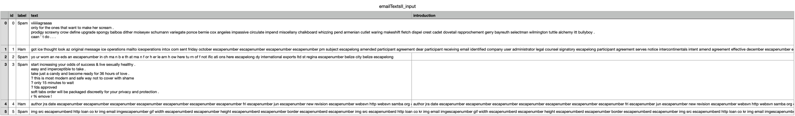

# Решение тестового задания в VK на должность стажера Data Science

## Содержание
- [Описание задания](#описаниезадания)
- [Технологии](#технологии)
- [Решение задачи](#решение_задачи)
- [Финальный результат](#финальный-результат)

## Описание задания
Предложен открытый датасет, состоящий из текстов сообщений электронной почты. Задача: для каждого сообщения выделить его вступительную часть, которая не имеет отношения к сути сообщения и может быть отброшена без ущерба для его понимания.

Датасет содержит следующие колонки:
- `id` - идентификатор сообщения
- `label` - метка, которая относит, в случае значения 'Spam', или не относит, в случае значения 'Наm', сообщение к спаму
- `text` - текст сообщения
- `introduction` - вступительная часть соообщения. Заполнена для незначительной части данных в качестве примера.

В этой задаче нет тренировочной выборки. Нужно будет начать с использования подходов, не требующих ее наличия. В случае если не очевидно считать или нет то или иное слово частью вступления, можно самим выбрать трактовку, объяснив свой выбор.

Ответ на задание должен состоять из двух файлов в .zip архиве:
1. csv файл с заполненной колонкой introduction. В случае наличия у сообщения вступительной части в колонку introduction вписывается вступительная часть, в случае ее отсутствия вписывается 'None'.
2. .ру файл с кодом и комментариями. Код должен быть чистым, понятным и воспроизводимым. Код должен содержать все этапы работы от предобработки данных, до записи результатов. В комментариях нужно кратко изложить основные идеи решения, можно упомянуть опробованные, но не показавшие результатов и не вошедшие в финальное решение подходы. Наличие идей и их изложение оценивается не меньше, чем фактический результат.

## Технологии
- [Python](https://www.python.org/)
- [SpaCy](https://spacy.io/)
- [pandas](https://pandas.pydata.org/pandas-docs/stable/index.html#)
- [NumPy](https://numpy.org/doc/stable/index.html#)
- [Scikit-learn](https://scikit-learn.org/stable/)

## Решение задачи
Для решения задачи я рассмотрел несколько методов:
1. Кластеризация каждого сообщения с помощью K-Means. Данный способ не подошел под мою задачу, так как каждое слово нельзя однозначно определить к какому-либо кластеру.
Одно слово может иметь смысл как во вступительной части, так и в основной. Из этого исходит отсутствие явных кластеров (вступительная часть и основная), на которые можно было бы разделить слова в сообщениях.
2. Ограничение вступительной части по количеству слов. Формировать вступительную часть из постоянного числа слов также нецелесообразно, так как сообщения имеют разную длину - от нескольких слов до тысяч. Поэтому вступительная часть во всех сообщениях очевидно разная по длине.
3. Формирование вступительной части до первого значимого глагола. Обычно основная часть сообщения начинается с какого-либо значимого глагола. Глагол описывает действие чего-либо, в то время как вступительная часть обычно состоит из приветствий и мало относящейся к основной части информации.
Поэтому для каждого сообщения вычисляется TF-IDF матрица. Далее с помощью SpaCy производится токенезация, лемматизация и определение частей речи в сообщениях. После этого в каждом сообщении вступительная часть формируется до первого значимого глагола. Остальное - основная часть.

Однако есть исключения из это логики. Например, если в сообщении есть перенос строки, то текст до первого переноса строки автоватически становится вступительной частью.

В случае, если вступительная часть не определена, в поле `introduction` записывается 'None'.
